# 🛡️ WeSafeSite: Autonomous Friendly Hackers

> **Sees Everything. Fixes Everything.**  
> A multi-agent security system that continuously tests, detects, and patches website vulnerabilities before real attackers can exploit them.


---

## 🌟 Overview

Companies usually discover vulnerabilities only *after* attackers have already exploited them. **WeSafeSite** solves this by deploying a coordinated team of "friendly hacker" AI agents that work proactively to find and fix security issues 24/7.

### The Core Problem & Solution
| 🔴 The Problem | 🟢 The WeSafeSite Solution |
| :--- | :--- |
| Manual pentesting is slow and expensive. | **Autonomous Agents** scan continuously. |
| Vulnerabilities sit unpatched for weeks. | **AI Patching** generates fixes instantly. |
| Security reports are hard to understand. | **Visual Dashboards** & PDF reports simplify data. |

---

## 🏗️ Architecture: The Multi-Agent System


WeSafeSite utilizes a **Hierarchical Agentic Workflow** to simulate a full security operations center (SOC).

```mermaid
graph TD
    User[User / Dashboard] -->|Target URL| Orchestrator[Agent Orchestrator]
    Orchestrator -->|Step 1| Recon[🕵️ Recon Agent]
    Orchestrator -->|Step 2| Scanner[⚡ Scanner Agent]
    Orchestrator -->|Step 3| Patcher[🤖 Patcher Agent]
    Orchestrator -->|Step 4| Memory[🧠 Memory Agent]
    
    Recon -->|Map Attack Surface| Scanner
    Scanner -->|Identify Flaws| Patcher
    Patcher -->|Generate Code Fix| User
    Memory -->|Log Trends| Dashboard
```




### 🕵️ 1. Reconnaissance Agent
*   **Role:** The Scout.
*   **Task:** Maps the website structure, identifies endpoints, checks DNS/SSL configurations, and finds entry points.

### ⚡ 2. Vulnerability Scanner Agent
*   **Role:** The Attacker.
*   **Task:** safely executes heuristic attacks to find specific flaws including:
    *   💉 SQL Injection (SQLi)
    *   ☠️ Cross-Site Scripting (XSS)
    *   🔓 CSRF & SSRF
    *   🔑 IDOR & Auth Weaknesses
    *   🛡️ Missing Security Headers

### 🤖 3. Patch Recommendation Agent (Gemini AI)
*   **Role:** The Engineer.
*   **Task:** Analyzes the vulnerability context and uses **Google Gemini 2.5** to write secure, copy-pasteable code fixes tailored to the specific language/framework.

### 🧠 4. Memory System
*   **Role:** The Analyst.
*   **Task:** Tracks historical data to generate trend reports, ensuring the same vulnerability doesn't appear twice.

---

## 🛠️ Tech Stack

### Frontend Core
*   **⚛️ React 19**: Component-based UI architecture.
*   **🟦 TypeScript**: Type-safe development for robust code.
*   **🌪️ Tailwind CSS v4**: Utility-first styling engine.
*   **🎬 Framer Motion**: Advanced animations for the "Agent Visualizer" and pipeline effects.

### UI & UX
*   **🧩 Lucide React**: Professional icon set.
*   **📊 Recharts**: Data visualization for threat trends.
*   **📄 Print/PDF Support**: CSS media queries for generating professional reports.

### AI & Backend Simulation
*   **🧠 Google Gemini API**: Powering the generative AI patching logic.
*   **🔄 Agent Orchestrator**: A custom TypeScript service simulating async agent communication and state management.

---

## 📂 Project Structure

```bash
/
├── index.html              # Entry point & PDF Print styles
├── src/
│   ├── App.tsx             # Main Router & Layout
│   ├── types.ts            # TS Interfaces (Vulnerability, AgentLog)
│   ├── pages/
│   │   └── Landing.tsx     # Hero page with Binary Pipeline Animation
│   ├── components/
│   │   ├── Login.tsx       # Auth with Cyber-security visuals
│   │   ├── Dashboard.tsx   # Mission Control & Charts
│   │   ├── AgentVisualizer.tsx # Live Terminal/Agent Simulation
│   │   ├── ScanResults.tsx # Report View & PDF Download
│   │   └── Settings.tsx    # Config Management
│   └── services/
│       ├── agentSystem.ts  # The "Backend" Logic / Orchestrator
│       └── geminiService.ts# Integration with Google AI
```

---

## 🚀 Installation & Getting Started

### Prerequisites
*   Node.js (v18+)
*   npm or yarn
*   A Google Gemini API Key

### 1. Clone the Repository
```bash
git clone https://github.com/yourusername/wesafesite.git
cd wesafesite
```

### 2. Install Dependencies
```bash
npm install
```

### 3. Configure Environment
Create a `.env` file in the root directory:
```env
API_KEY=your_google_gemini_api_key_here
```

### 4. Run the Application
```bash
npm run dev
```
Open your browser to `http://localhost:5173`.

---

## 🎮 Usage Guide

1.  **Landing Protocol**: Visit the home page to see the "Agent Pipeline" animation explaining the workflow.
2.  **Authentication**: Click "Get Started". Use the mock credentials or create a new account (data is local for the demo).
3.  **Mission Control**: On the Dashboard, enter a target URL (e.g., `https://example.com`) in the "Target Acquisition" field.
4.  **Deploy Agents**: Click "Deploy". Watch the **Agent Visualizer** terminal as the Recon and Scanner agents execute their tasks in real-time.
5.  **View Report**: Once the mission is 100% complete, click "View Remediation Report".
6.  **Fix & Export**:
    *   Expand a vulnerability to see the **AI Generated Patch**.
    *   Click **Download Report** to generate a professional PDF summary for stakeholders.

---

## 🔒 Security Capabilities

The system currently simulates checks for:
*   [x] SQL Injection
*   [x] XSS (Reflected/Stored)
*   [x] CSRF & SSRF
*   [x] IDOR (Insecure Direct Object Reference)
*   [x] Open Redirects
*   [x] HTTPS/SSL Misconfigurations
*   [x] Dependency Vulnerabilities

---

## 📄 License

This project is licensed under the MIT License - see the LICENSE file for details.

---

> Built with 💻 and 🛡️ by the WeSafeSite Team.
